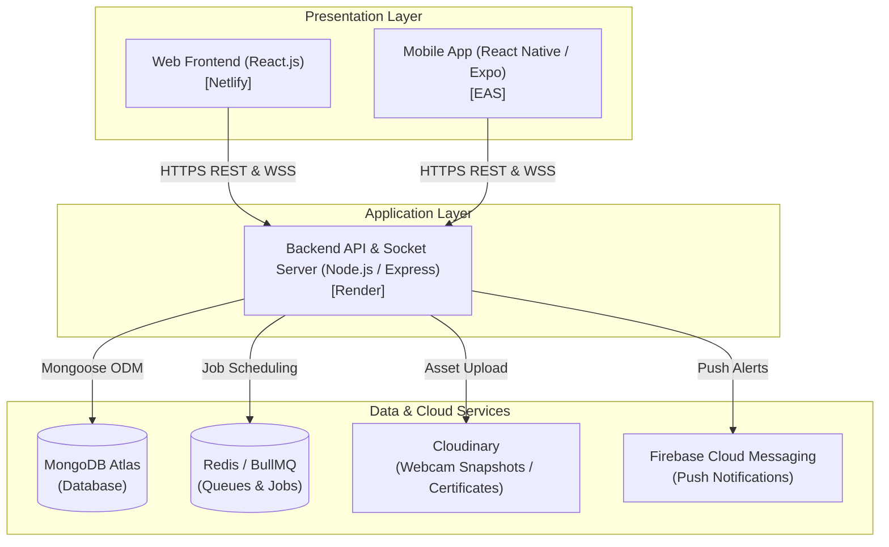
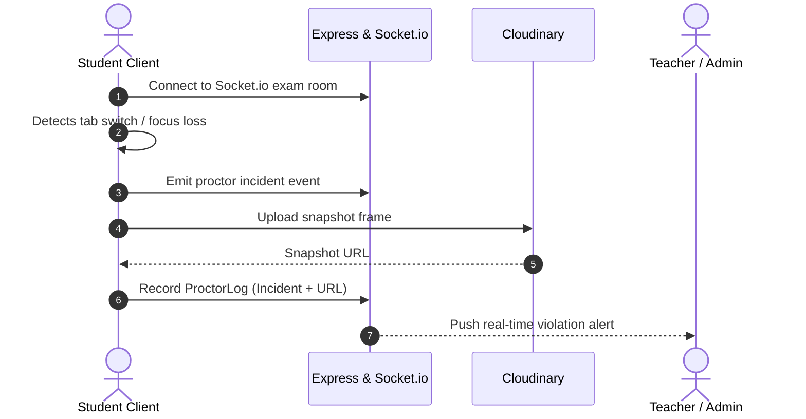

# ExamSphere - System Architecture

This document outlines the high-level architecture, technology stack, data flow, and deployment infrastructure for the **ExamSphere** platform.

---

## 1. System Overview

ExamSphere is a multi-client online examination and proctoring platform designed for educational institutions and organizations. The architecture separates the user presentation layers (Web Frontend and Mobile App) from the central backend services and data tier.

---

## 2. Technology Stack & Hosting Summary

| Component | Technology | Hosting / Provider | Purpose |
| :--- | :--- | :--- | :--- |
| **Web Frontend** | React.js (SPA) | Netlify | Administrative portal, teacher exam authoring, and student exam portal for desktop/laptop browsers. |
| **Mobile App** | React Native / Expo | Expo Application Services (EAS) | Cross-platform mobile candidate application for Android and iOS devices. |
| **Backend API** | Node.js / Express.js | Render | RESTful API service handling business logic, validation, and authentication. |
| **Database** | MongoDB | MongoDB Atlas | Multi-tenant NoSQL document database storing users, exams, submissions, and logs. |
| **Real-Time Engine** | Socket.io | Node.js / Render | Bi-directional WebSocket channels for real-time proctoring alerts and live leaderboards. |
| **Media Storage** | Cloudinary | Cloudinary CDN | Secure cloud storage for proctoring webcam violation snapshots and generated certificates. |
| **Push Notifications** | Firebase Cloud Messaging (FCM) | Google Cloud | Push notifications alerting students about upcoming exams, deadlines, and published results. |
| **Background Jobs** | BullMQ & `node-cron` | Redis / Render Worker | Scheduled exam activation/closure, automatic submission on timer expiry, and batch grading jobs. |

---

## 3. Component Deep Dive

### 3.1 Web Frontend (`web-frontend/`)
- Built with React.js using modular hooks and component-driven architecture.
- Fullscreen and window visibility tracking via HTML5 Page Visibility API and Fullscreen API for client-side proctoring.
- Media capture via WebRTC / `navigator.mediaDevices` for camera snapshots during proctoring sessions.
- Continuous deployment hosted on Netlify with automated preview branches.

### 3.2 Mobile App (`mobile-app/`)
- Built with React Native and Expo managed workflow.
- Native device integration for app state detection (detecting when student switches away or minimizes the app).
- Cross-platform distribution via Expo Application Services (EAS Build and Submit).

### 3.3 Backend API & Services (`backend/`)
- Express.js HTTP server paired with Socket.io server on unified port.
- Modular layer architecture:
  - `routes/`: Express endpoint routing definitions.
  - `controllers/`: HTTP request parsing and response formatting.
  - `services/`: Core business logic, grading engine, and external cloud integrations.
  - `models/`: Mongoose schemas and data validation models.
  - `middleware/`: Authentication guards (JWT), role-based access control (RBAC), and error handling.
  - `utils/`: Shared helper functions, token generators, and validators.
- Containerized and hosted on Render with health check monitoring.

### 3.4 Data & Storage Layer
- **MongoDB Atlas**: Scalable cloud NoSQL database providing document flexibility for varied question types and nested exam sections.
- **Cloudinary**: Offloads high-bandwidth binary image storage (webcam captures, generated PDF certificates) with CDN delivery.
- **Redis & BullMQ / node-cron**: Manages background asynchronous workloads such as timer reconciliation and mass notification dispatch.

---

## 4. Real-Time Proctoring & Communications

