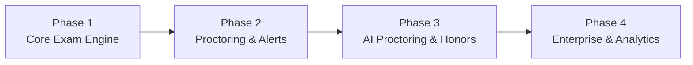

# ExamSphere - Development Phase Roadmap

This document outlines the 4-phase implementation plan for the 3-person engineering team (Backend Engineer, Web Frontend Engineer, and Mobile App Engineer).

---

## Roadmap Summary

---

## Phase 1: Core Exam Engine
*Goal: Deliver end-to-end functionality for authoring, distributing, taking, and auto-evaluating examinations.*

### Scope & Features
- **Auth**: User registration, login, role assignment (`student`, `teacher`, `admin`), JWT authentication, and route guards.
- **Exam CRUD**: Teacher/Admin dashboard to create, configure, update, schedule, and delete exams and question sets (MCQ, True/False, Subjective).
- **Exam-taking**: Student exam-taking interface on Web and Mobile with timer management, question navigation palette, and answer state persistence.
- **Auto-grading**: Server-side grading pipeline for objective question types (MCQ and T/F) with negative marking support.
- **Basic Results**: Instant candidate score generation, summary views, and question-by-question review screens.

### 3-Person Team Responsibilities
- **Backend Engineer**: Auth routes, JWT middleware, Exam & Question CRUD APIs, submission intake, and auto-evaluation logic.
- **Web Frontend Engineer**: Auth pages, Teacher Exam Builder portal, Student Exam Runner UI, and Results summary dashboard.
- **Mobile App Engineer**: Auth screens, Student Exam Dashboard, mobile-optimized exam taking flow, and candidate score view.

---

## Phase 2: Proctoring, Analytics & Notifications
*Goal: Ensure examination integrity with automated environment checks and candidate activity tracking.*

### Scope & Features
- **Proctoring**:
  - Tab-switch and window blur detection (Web Page Visibility API & Mobile AppState listeners).
  - Enforced fullscreen mode with breach warnings.
  - Automated webcam snapshots captured on violation events or periodic intervals.
- **Analytics**: Exam performance metrics for educators (average score, score distribution, question difficulty index, drop-off rates).
- **Notifications**: Automated dispatch via Firebase Cloud Messaging (FCM) and in-app alerts for scheduled exams, approaching deadlines, and published results.

### 3-Person Team Responsibilities
- **Backend Engineer**: `/api/proctor` logging endpoints, Cloudinary media upload integration, FCM dispatch service, and analytics aggregation queries.
- **Web Frontend Engineer**: Fullscreen enforcement module, tab blur listener, camera snapshot capture, and teacher proctoring report viewer.
- **Mobile App Engineer**: Native AppState blur listener, camera snapshot background capture, and FCM push notification handling.

---

## Phase 3: Live Proctoring, Leaderboard & Certificates
*Goal: Advance security with real-time detection, candidate gamification, and credential issuance.*

### Scope & Features
- **Live Webcam + Face Detection**: Real-time client-side face presence verification (detecting absence of face or presence of multiple faces).
- **Leaderboard**: Real-time ranked leaderboards powered by Socket.io for competitive exams.
- **Certificates**: Automated certificate generation for qualifying candidates with downloadable PDFs and verifiable credentials.

### 3-Person Team Responsibilities
- **Backend Engineer**: Socket.io live room management, certificate generation pipeline (PDFKit/Canvas), and Cloudinary certificate storage.
- **Web Frontend Engineer**: Client-side ML face detection (TensorFlow.js / MediaPipe FaceMesh), live proctor monitor feed, and certificate viewer.
- **Mobile App Engineer**: Camera face verification pipeline, real-time exam leaderboard screen, and certificate download.

---

## Phase 4: Multi-Tenancy & Admin Reports
*Goal: Scale platform capabilities to support multiple institutions with comprehensive reporting.*

### Scope & Features
- **Multi-tenancy**: Institution-level data isolation, custom organization domains/slugs, organization-wide member management, and role hierarchies.
- **Admin Reports**: Executive reporting suite for institutional administrators (department-wide performance, student engagement, integrity audit logs, exportable CSV/PDF reports).

### 3-Person Team Responsibilities
- **Backend Engineer**: Multi-tenant data filtering middleware, organization hierarchy APIs, batch CSV export engine, and audit trail aggregation.
- **Web Frontend Engineer**: Multi-tenant admin management console, tenant branding customization, and interactive reporting charts.
- **Mobile App Engineer**: Organization selector/switcher, student institutional profile, and verified institutional exam badges.
